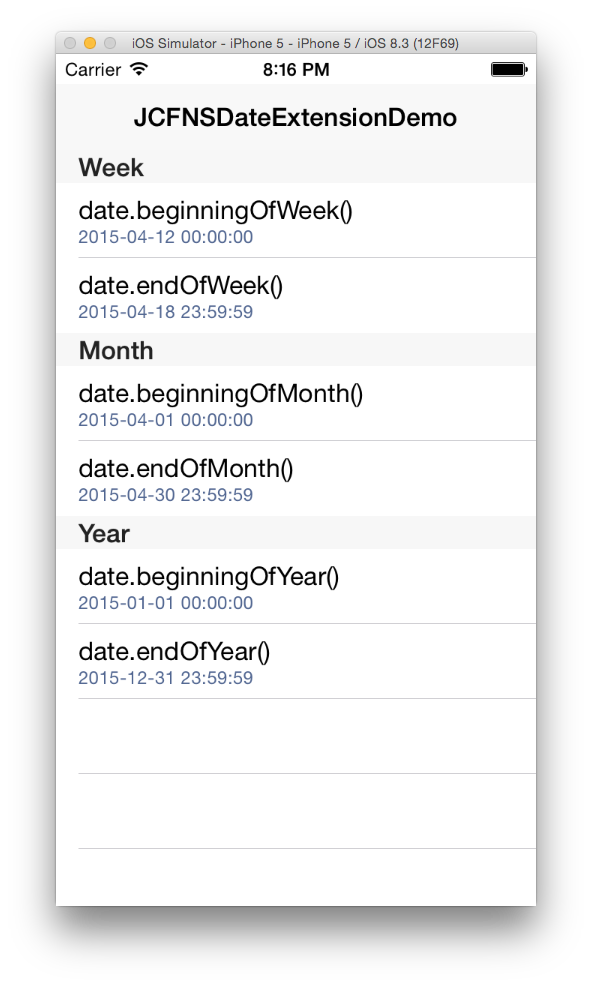

# JCFNSDateExtension
A NSDate extension with helpers to handle some date calculations
Compatible with Swift 1.2

### Important
All the dates are timezone aware and use as base calendar
the calendar defined in user´s regional settings, which 
in most cases will be the gregorian calendar.


### Available Helpers
```Swift
date.beginningOfWeek() -> NSDate
date.endOfWee() -> NSDate
date.beginningOfMonth() -> NSDate
date.endOfMonth() -> NSDate
date.beginningOfYear() -> NSDate
date.endOfYear() -> NSDate
```

### Demo Project

The demo project shows how you can use the extension.
It presents the date in a localized for by using a NSDateFormatter.


